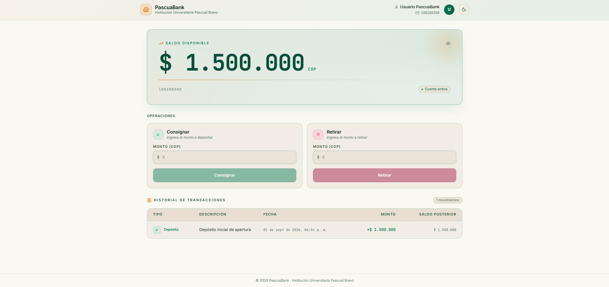
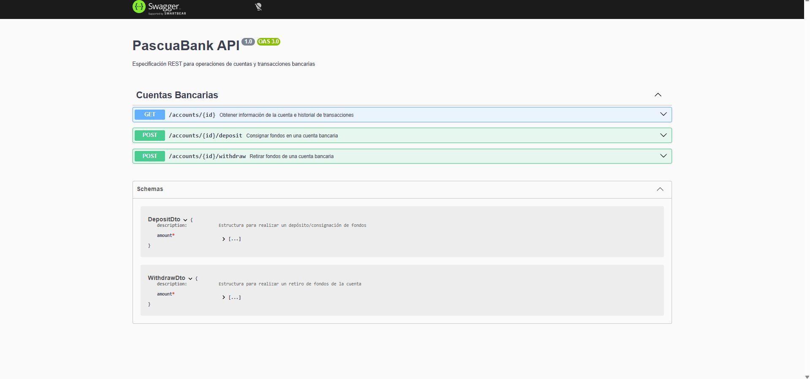

# 🏦 PascuaBank - Sistema Bancario Digital

Prototipo de aplicación bancaria (monorepo) desarrollado como proyecto académico para la Institución Universitaria Pascual Bravo. Simula las operaciones básicas de una cuenta de ahorros (depósitos y retiros) bajo una arquitectura en capas, con validaciones estrictas de negocio y trazabilidad de transacciones.

---

## 📑 Tabla de Contenidos

- [Vista Previa del Sistema](#-vista-previa-del-sistema)
- [Integrantes y Roles](#-integrantes-y-distribución-de-roles-50--50)
- [Stack Tecnológico](#️-stack-tecnológico)
- [Arquitectura](#-arquitectura)
- [Estructura del Proyecto](#-estructura-del-proyecto)
- [Requisitos Previos](#-requisitos-previos)
- [Instalación y Flujos de Ejecución](#-instalación-y-flujos-de-ejecución)
- [Documentación de la API](#-documentación-de-la-api)
- [Testing](#-testing)
- [Flujo de Trabajo (Git)](#-flujo-de-trabajo-git)

---

## 📸 Vista Previa del Sistema

### Dashboard Principal del Cliente

*Interfaz de usuario en React con tarjeta de saldo disponible ($1.500.000 COP), formularios de consignación/retiro e historial de transacciones.*

<br />

### Documentación Interactiva de la API (Swagger)

*Especificación OpenAPI (Swagger UI) expuesta en NestJS con la definición de endpoints REST y DTOs de transferencias.*

---

## 👥 Integrantes y Distribución de Roles (50% / 50%)

| Integrante | Rol | Responsabilidades Principales |
| :--- | :--- | :--- |
| **Andrés Goez** | Backend & Data Architect | API REST en NestJS, esquema Prisma ORM, reglas de negocio, DTOs y documentación Swagger. |
| **Felipe Cano** | Frontend & Product Lead | UI/UX en React + Vite, integración Axios, validaciones en cliente, documentación y presentación. |

---

## 🛠️ Stack Tecnológico

| Capa | Tecnologías |
| :--- | :--- |
| **Frontend** | React 18, Vite, TypeScript, Tailwind CSS, Lucide React, Axios |
| **Backend** | NestJS, TypeScript, class-validator / class-transformer |
| **Persistencia** | PostgreSQL (producción) / SQLite (desarrollo), Prisma ORM |
| **Documentación / Pruebas de API** | Swagger (OpenAPI), Postman Collection |
| **Flujo de Trabajo** | Git Flow (`main`, `dev`, `feature/*`), Conventional Commits |

---

## 🏗️ Arquitectura

El backend sigue una **Arquitectura en Capas** con separación estricta de responsabilidades:

```
Controllers → DTOs (validación) → Services (reglas de negocio) → Repositories/Prisma (persistencia)
```

**Decisiones clave de diseño:**

- **Montos en enteros (centavos):** evita errores de precisión de coma flotante (`0.1 + 0.2`) usando `Decimal` de Prisma o manejo en centavos.
- **Operaciones atómicas:** los retiros validan `balance - amount >= 0` a nivel de base de datos para prevenir condiciones de carrera en operaciones concurrentes.
- **Trazabilidad:** cada depósito/retiro se registra como una entrada inmutable en un historial de transacciones, no solo como una actualización de saldo.
- **Validación en capas:** `ValidationPipe` global sanea y valida cada payload antes de que llegue a la lógica de negocio.

---

## 📂 Estructura del Proyecto

```
PascuaBank/
├── client/                  # Frontend - React + Vite + TypeScript
│   ├── public/
│   ├── src/
│   ├── index.html
│   ├── tsconfig.json
│   └── vite.config.ts
│
├── server/                  # Backend - NestJS + Prisma
│   ├── prisma/               # Esquema y migraciones de base de datos
│   ├── src/                  # Controllers, Services, DTOs
│   ├── test/                 # Pruebas unitarias / e2e
│   ├── nest-cli.json
│   └── prisma.config.ts
│
├── docker-compose.yml         # PostgreSQL local para desarrollo (credenciales dummy, no usar en producción)
└── README.md
```


---

## ✅ Requisitos Previos

- **Node.js** ≥ 18.x
- **npm** ≥ 9.x
- **Docker** y **Docker Compose** (recomendado, para levantar PostgreSQL sin instalación nativa) — alternativamente, PostgreSQL instalado localmente o SQLite para desarrollo rápido

---

## 🚀 Instalación y Flujos de Ejecución

PascuaBank permite 3 modalidades de ejecución según las necesidades del entorno de desarrollo o evaluación:

### 1. Clonar el repositorio

```bash
git clone https://github.com/Pipe-C/PascuaBank.git
cd PascuaBank
```

---

### Flujo 1: Desarrollo Local (DB en Docker, Apps en Local)
Ideal para desarrollo activo del frontend o backend con soporte para recarga rápida (HMR / Hot Reload).

1. **Levantar únicamente la base de datos PostgreSQL:**
   ```bash
   docker compose up -d postgres
   ```
2. **Iniciar el Backend (NestJS en puerto 3000):**
   ```bash
   cd server
   npm install
   npx prisma migrate dev
   npm run start:dev
   ```
3. **Iniciar el Frontend (Vite + React en puerto 5173):**
   ```bash
   cd client
   npm install
   cp .env.example .env
   npm run dev
   ```
   *Asegúrate de que en `client/.env` las variables estén configuradas como `VITE_API_URL=http://localhost:3000` y `VITE_USE_MOCK=false`.*

- **Frontend App:** `http://localhost:5173`
- **Backend API & Swagger:** `http://localhost:3000/api/docs`

---

### Flujo 2: Stack Completo en Docker (Producción / Verificación Live)
Despliega la totalidad del sistema en contenedores aislados de forma automatizada (PostgreSQL, NestJS API y Nginx para el frontend de producción).

1. **Construir y levantar todo el stack en la raíz del proyecto:**
   ```bash
   docker compose up --build
   ```
2. **Servicios y Puertos Expuestos:**
   - **Frontend (Nginx - Producción):** `http://localhost:8080`
   - **Backend (NestJS API REST):** `http://localhost:3000`
   - **Base de Datos (PostgreSQL):** `localhost:5432`
3. **Poblado Automático de Datos (Seed):**
   Al iniciar el contenedor del backend se ejecutan automáticamente las migraciones y el seed inicial (definido en [`server/prisma/seed.ts`](server/prisma/seed.ts)), creando la cuenta bancaria de prueba predeterminada:
   - **ID de Cuenta:** `"1"`
   - **Número de Cuenta:** `100200300`
   - **Titular:** `Usuario PascuaBank`
   - **Saldo Inicial:** `$1.500.000,00 COP`

---

### Flujo 3: Alternativa Ligera con SQLite (Sin Docker / Sin Postgres)
Diseñado para evaluaciones rápidas en máquinas con recursos limitados o sin el daemon de Docker disponible.

1. **Configurar el DataSource en `server/prisma/schema.prisma`:**
   ```prisma
   datasource db {
     provider = "sqlite"
   }
   ```
2. **Configurar la cadena de conexión en `server/.env`:**
   ```env
   DATABASE_URL="file:./dev.db"
   ```
3. **Poblar la base de datos local e iniciar el servidor:**
   ```bash
   cd server
   npx prisma db push
   npx tsx prisma/seed.ts
   npm run start:dev
   ```

> [!WARNING]
> **Advertencia de reversión de esquema:**
> Modificar [`server/prisma/schema.prisma`](server/prisma/schema.prisma) a `sqlite` altera un archivo compartido utilizado en los Flujos 1 y 2 (los cuales requieren `postgresql`). Antes de volver a los flujos principales o realizar un commit, debes revertir el cambio ejecutando:
> ```bash
> git checkout -- server/prisma/schema.prisma
> ```
> No se debe commitear el archivo `schema.prisma` en modo `sqlite` para mantener la consistencia del repositorio con el equipo.

---

## 📖 Documentación de la API

- **Swagger UI:** `http://localhost:3000/api/docs` — interfaz interactiva para probar endpoints en tiempo real.
- **Postman Collection:** archivo JSON con requests preconfigurados (Deposit, Withdraw, Get Balance) y variables de entorno para pruebas automatizadas (ajustar según ubicación real en el proyecto).

---

## 🧪 Testing

### Backend (`/server`)
```bash
cd server
npm run test        # Pruebas unitarias (Jest)
npm run test:e2e    # Pruebas end-to-end
npm run test:cov    # Cobertura de código
```

### Frontend (`/client`)
```bash
cd client
npm run test        # Suite de pruebas unitarias y de integración (Vitest + React Testing Library)
```
> Para más detalles sobre la arquitectura de pruebas y componentes del frontend, consulta el [`client/README.md`](client/README.md).

---

## 🔀 Flujo de Trabajo (Git)

- **`main`:** rama estable, solo recibe merges desde `dev`.
- **`dev`:** rama de integración de features.
- **`feature/*`:** una rama por funcionalidad (ej. `feature/withdraw-endpoint`).
- **Commits:** siguen la convención [Conventional Commits](https://www.conventionalcommits.org/) (`feat:`, `fix:`, `docs:`, etc.).
- **CI:** GitHub Actions ejecuta linter, validación de tipos (`tsc`) y tests automatizados en cada push o Pull Request.

---

## 📄 Licencia

Proyecto académico desarrollado para fines educativos — Institución Universitaria Pascual Bravo.